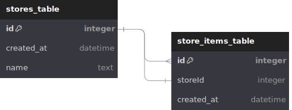

# Flutter Drift Sample

Shows how to use [drift](https://pub.dev/packages/drift) by modelling a simple relational DB with a parent - child relationship using a foreign key constraints including cascade delete. The example follows a domain driven approach where the [domain entities](lib/domain/entities/) are decoupled from the [DB access objects](lib/data/models/).

Furthermore table changes, following migrations and testing those are shown exemplary. See [app_database.dart](lib/data/datasources/app_database.dart) and [generated_migrations](generated_migrations/) for further information. 

## Build
* `git clone https://github.com/d-wolf/flutter_drift_sample.git`
* `dart run build_runner build --delete-conflicting-outputs`
* `flutter run`
